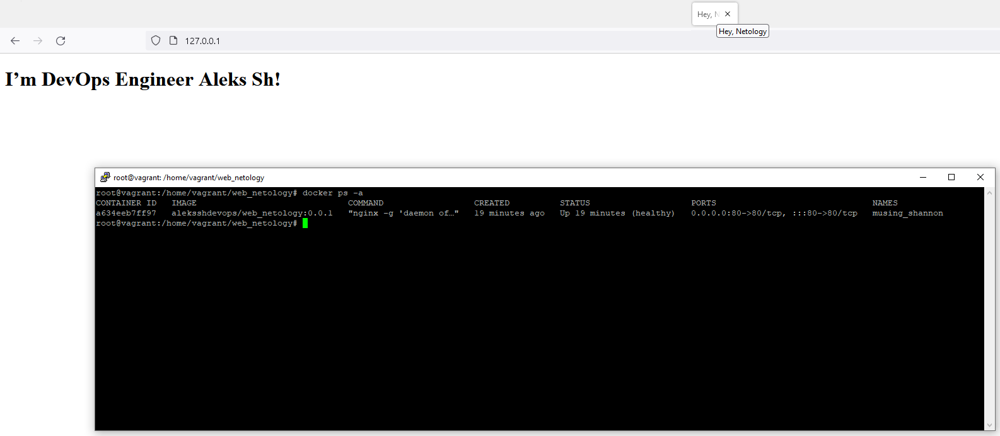

# 05-virt-03-docker

## Задача 1

Сценарий выполения задачи:

- создайте свой репозиторий на https://hub.docker.com;
- выберете любой образ, который содержит веб-сервер Nginx;
- создайте свой fork образа;
- реализуйте функциональность:
запуск веб-сервера в фоне с индекс-страницей, содержащей HTML-код ниже:
```
<html>
<head>
Hey, Netology
</head>
<body>
<h1>I’m DevOps Engineer!</h1>
</body>
</html>
```
Опубликуйте созданный форк в своем репозитории и предоставьте ответ в виде ссылки на https://hub.docker.com/username_repo.

## Ответ

Страница немного хреново отображалась, поэтому чуть подправил html  
https://github.com/aleks-sh-devops/web_netology - Это файлы для сборки образа и скрипт для сборки/запуска, который накидал.  
https://hub.docker.com/r/aleksshdevops/web_netology - Это уже собранный и опубликованный образ.  



## Задача 2

Посмотрите на сценарий ниже и ответьте на вопрос:
"Подходит ли в этом сценарии использование Docker контейнеров или лучше подойдет виртуальная машина, физическая машина? Может быть возможны разные варианты?"

Детально опишите и обоснуйте свой выбор.

--

Сценарий:

- Высоконагруженное монолитное java веб-приложение;
- Nodejs веб-приложение;
- Мобильное приложение c версиями для Android и iOS;
- Шина данных на базе Apache Kafka;
- Elasticsearch кластер для реализации логирования продуктивного веб-приложения - три ноды elasticsearch, два logstash и две ноды kibana;
- Мониторинг-стек на базе Prometheus и Grafana;
- MongoDB, как основное хранилище данных для java-приложения;
- Gitlab сервер для реализации CI/CD процессов и приватный (закрытый) Docker Registry.

## Ответ
- Высоконагруженное монолитное java веб-приложение;  
Монолиты - это явно не про контейнеры. ВМ либо физический сервер. ВМ удобно бэкапить, а у физического кпд выше.  

- Nodejs веб-приложение;  
Контейнеры в Nodejs, как понимаю - обычная история и давно уже используется повсеместно.   

- Мобильное приложение c версиями для Android и iOS;  
Не знаю специфики, но думаю физ сервер для этого использовать слишком жирно. В ВМ или контейнер. Думаю, что зависит от нагрузки.  

- Шина данных на базе Apache Kafka;  
На продакшене я бы юзал ВМ или физ. сервак, так как контейнер - вещь непостоянная и если он упадет можно потерять данные.  

- Elasticsearch кластер для реализации логирования продуктивного веб-приложения - три ноды elasticsearch, два logstash и две ноды kibana;  
В физической машине точно отсутствует необходимость. Видел как реализацию на ВМ, так и на Контейнерах. Тут, по всей видимости, ключевой момент в нагрузке джава любит есть. И поэтому необходимо смотреть на потребление ресурсов.  

- Мониторинг-стек на базе Prometheus и Grafana;  
Докер контейнеры. В физической машине или виртуальной машине отсутствует необходимость  

- MongoDB, как основное хранилище данных для java-приложения;  
Тут нeжно смотреть на нагрузку. Понятное дело что инфа хранится вне контейнера. Джава прожорлива поэтому контейнер может не вытянуть (Хотя образ имеется https://hub.docker.com/_/mongo). Я бы смотрел в сторону ВМ. Ну и разумеется кластеризация.  

- Gitlab сервер для реализации CI/CD процессов и приватный (закрытый) Docker Registry.  
Имел возможность потестировать Гитлаб и в качестве ВМ и в качестве контейнера. По мне - самый лучший вариант контейнеры гитлаб и закрытого Docker Registry. Это упрощает процесс миграции и обновления. Тем более нагрузка при разворачивании проектов ложится, как понимаю, на раннеры.

## Задача 3

- Запустите первый контейнер из образа ***centos*** c любым тэгом в фоновом режиме, подключив папку ```/data``` из текущей рабочей директории на хостовой машине в ```/data``` контейнера;
- Запустите второй контейнер из образа ***debian*** в фоновом режиме, подключив папку ```/data``` из текущей рабочей директории на хостовой машине в ```/data``` контейнера;
- Подключитесь к первому контейнеру с помощью ```docker exec``` и создайте текстовый файл любого содержания в ```/data```;
- Добавьте еще один файл в папку ```/data``` на хостовой машине;
- Подключитесь во второй контейнер и отобразите листинг и содержание файлов в ```/data``` контейнера.

## Ответ  
Автоматизируем и стартуем:  
```
mkdir ~/data && \
docker container run -d -v ~/data:/data --name aleks-debian -t debian:latest && \
docker container run -d -v ~/data:/data --name aleks-centos -t centos:latest


Emulate Docker CLI using podman. Create /etc/containers/nodocker to quiet msg.
Resolved "debian" as an alias (/etc/containers/registries.conf.d/000-shortnames.conf)
Trying to pull docker.io/library/debian:latest...
Getting image source signatures
Copying blob f2f58072e9ed done  
Copying config 291bf16807 done  
Writing manifest to image destination
Storing signatures
366698eb25b87b9aed44720d752b3f7a630c8beb619cb074b56dbe8102bbea21
Emulate Docker CLI using podman. Create /etc/containers/nodocker to quiet msg.
Resolved "centos" as an alias (/etc/containers/registries.conf.d/000-shortnames.conf)
Trying to pull quay.io/centos/centos:latest...
Getting image source signatures
Copying blob 7a0437f04f83 done  
Copying config 300e315adb done  
Writing manifest to image destination
Storing signatures
a0859cfa066a4ce36ff4c0da1c79b1d14715d86e7cdf955f6fad3f57b6abcb06
```

Смотрим результат:  
```
docker container ps
Emulate Docker CLI using podman. Create /etc/containers/nodocker to quiet msg.
CONTAINER ID  IMAGE                            COMMAND     CREATED         STATUS             PORTS       NAMES
366698eb25b8  docker.io/library/debian:latest  bash        40 seconds ago  Up 40 seconds ago              aleks-debian
a0859cfa066a  quay.io/centos/centos:latest     /bin/bash   20 seconds ago  Up 19 seconds ago              aleks-centos
```

Создаем файл в контейнере 1  
```
[root@vmtester2 ~]# docker container exec -it aleks-centos bash
Emulate Docker CLI using podman. Create /etc/containers/nodocker to quiet msg.
[root@a0859cfa066a /]# hostname
a0859cfa066a
[root@a0859cfa066a /]# echo 'a0859cfa066a aleks-centos' >> /data/ct1.txt
[root@a0859cfa066a /]# ls -lah /data/
total 4.0K
drwxr-xr-x 2 root root 21 Dec  8 11:25 .
dr-xr-xr-x 1 root root 29 Dec  8 11:18 ..
-rw-r--r-- 1 root root 26 Dec  8 11:25 ct1.txt
[root@a0859cfa066a /]# cat /data/ct1.txt 
a0859cfa066a aleks-centos
[root@a0859cfa066a /]# exit
exit
[root@vmtester2 ~]#
```

Создаем файл на хостовой машине:  
```
root@vmtester2 ~]# echo 'root@vmtester2' >> ~/data/vm.txt
[root@vmtester2 ~]# ls -lah ~/data/
total 12K
drwxr-xr-x   2 root root   35 Dec  8 14:29 .
dr-xr-x---. 37 root root 4.0K Dec  8 14:17 ..
-rw-r--r--   1 root root   26 Dec  8 14:25 ct1.txt
-rw-r--r--   1 root root   15 Dec  8 14:29 vm.txt
[root@vmtester2 ~]# cat ~/data/*
a0859cfa066a aleks-centos
root@vmtester2
```

Проверяю файлы во втором контейнере:  
```
[root@vmtester2 ~]# docker container exec -it aleks-debian bash
Emulate Docker CLI using podman. Create /etc/containers/nodocker to quiet msg.
root@366698eb25b8:/# ls -lah /data/
total 8.0K
drwxr-xr-x 2 root root 35 Dec  8 11:29 .
dr-xr-xr-x 1 root root 40 Dec  8 11:17 ..
-rw-r--r-- 1 root root 26 Dec  8 11:25 ct1.txt
-rw-r--r-- 1 root root 15 Dec  8 11:29 vm.txt
root@366698eb25b8:/# cat /data/*
a0859cfa066a aleks-centos
root@vmtester2
root@366698eb25b8:/# exit
exit
```
